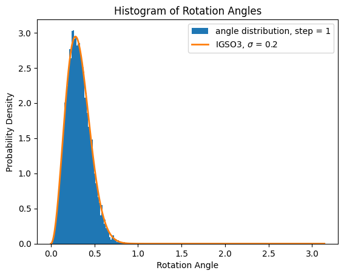

This theme supports rendering beautiful math in inline and display modes using [MathJax 3](https://www.mathjax.org/) engine. 

# Why bother diffusion in SO(3) space?
One typical way to represent the structure of proteins is to use the position of alpha carbon and the rotation matrix of each residue. So the diffusion process on the space of alpha carbon is simple Euclidean space, but the diffusion process on the rotation matrix ($$SO(3)$$ space) is non-Euclidean. This note aims to provide a rigorous formulation of diffusion model on $$SO(3)$$ space.

# Some definitions and identities
In this note, we do not always distinguish "group" and "representation of group", just like physicists.

With notation from the article, we define the basis of the lie algebra of $$SO(3)$$ group and their matrix representation as follows:
$$
\begin{equation}
\begin{array}{ll}
\mathbf{e}_1=\left[\begin{array}{l}
1 \\
0 \\
0 \\
\end{array}\right] & G_1=\mathbf{e}_1^{\times}=\left[\begin{array}{ccc}
0 & 0 & 0 \\
0 & 0 & -1 \\
0 & 1 & 0
\end{array}\right] 
\\
\\
\mathbf{e}_2=\left[\begin{array}{l}
0 \\
1 \\
0
\end{array}\right] & G_2=\mathbf{e}_2^{\times}=\left[\begin{array}{ccc}
0 & 0 & 1 \\
0 & 0 & 0 \\
-1 & 0 & 0
\end{array}\right]
\\
\\
\mathbf{e}_3=\left[\begin{array}{l}
0 \\
0 \\
1
\end{array}\right] & G_3=\mathbf{e}_3^{\times}=\left[\begin{array}{ccc}
0 & -1 & 0 \\
1 & 0 & 0 \\
0 & 0 & 0
\end{array}\right]
\end{array}
\end{equation}
$$

Thus we can exponentiate the lie algebra matrix representation to get the matrix representation of $SO(3)$ group, and get back by taking the logarithm of $$SO(3)$$ matrix.

The "box plus" operation is defined between a $$SO(3)$$ matrix $$\Phi$$ and a lie algebra vector $$\varphi$$
\begin{equation}
\label{eq:0}
\boxplus: SO(3) \times \mathbb{R}^3 \rightarrow SO(3), \quad
(\Phi, \boldsymbol{\varphi}) \mapsto \exp (\boldsymbol{\varphi}^{\times}) \circ \Phi
\end{equation}

The "box minus" operation is defined between two $$SO(3)$$ matrix.
\begin{equation}
\boxminus: SO(3) \times SO(3) \rightarrow \mathbb{R}^3, \quad
(\Phi_1, \Phi_2) \mapsto \log \left(\Phi_1 \circ \Phi_2^{-1}\right)
\end{equation}

$$\textbf{Some important identities}$$ ($$\boldsymbol{v}$$ is a vector in lie algebra, $$\boldsymbol{v}^{\times}$$ is its matrix representation):
$$
\begin{equation}
\label{eq:1}
\begin{aligned}
\left(\boldsymbol{v}^{\times}\right)^T & =-\boldsymbol{v}^{\times}, \\
\left(\boldsymbol{v}^{\times}\right)^2 & =\boldsymbol{v} \boldsymbol{v}^T-\boldsymbol{v}^T \boldsymbol{v} \boldsymbol{I}, \\
(\Phi \boldsymbol{v})^{\times} & = \Phi \boldsymbol{v}^{\times} \Phi^T
\end{aligned}
\end{equation}
$$
Especially the third identities, which will play important roles in the derivation of the score function.

With these definitions, we can define the derivative of a scalar function with argument to be $$SO(3)$$ matrix,
\begin{equation}
\label{eq:2}
\frac{\partial f_3}{\partial \Phi}=\lim _{\epsilon \rightarrow 0}\left[\begin{array}{l}
\frac{f_3\left(\Phi \boxplus\left(\mathbf{e}_1 \epsilon\right)\right)-f_3(\Phi)}{\epsilon} \\
\frac{f_3\left(\Phi \boxplus\left(\mathbf{e}_2 \epsilon\right)\right)-f_3(\Phi)}{\epsilon} \\
\frac{f_3\left(\Phi \boxplus\left(\mathbf{e}_3 \epsilon\right)\right)-f_3(\Phi)}{\epsilon}
\end{array}\right]
\end{equation}

We can represent the $$SO(3)$$ matrix in 3D space using axis-angle representation, in explicit terms, it can be written as:
$$
\begin{equation}
\overleftrightarrow{R}_n(\theta)_{i, j}=n_i n_j+\cos \theta \cdot\left(\delta_{i, j}-n_i n_j\right)-\sin \theta \cdot \sum_c \epsilon_{i j k} n_k, \text { here } i, j, k=x, y, z
\end{equation}
$$

Or more simply written using lie algebra matrix:
\begin{equation}
\overleftrightarrow{R}_n(\theta)=\exp ( \theta \overleftrightarrow{G} \bullet n)
\end{equation}
where $$\theta$$ is in the range $$[0, \pi]$$, and $$n$$ represents the rotation axis.

# Prior distribution and random walk in SO(3) space
To understand the $$SO(3)$$ group structure better, we can look at the double cover group of $$SO(3)$$, the $$SU(2)$$ group.

The Quaternion representation of $$SU(2)$$ group can be represented by four Pauli matrices as: 
\begin{equation}
U=a_0 \sigma_0-\dot{\mathbb{I}}\left(a_1 \sigma_1+a_2 \sigma_2+a_3 \sigma_3\right)=a_0 \sigma_0-\dot{\mathbb{I}} \boldsymbol{a} \cdot \boldsymbol{\sigma}
\end{equation}
where $$\sum_i a_i^2=a_0^2+\boldsymbol{a}^2=1$$.

So the manifold of $$SU(2)$$ group is a 3-sphere $$S^3$$ in 4D Euclidean space.

Another way to write the quaternion representation is to use axis and angle by $$U = \exp \left(-\dot{\mathbb{I}} \frac{\theta}{2} \boldsymbol{n} \bullet \boldsymbol{\sigma}\right) = \left(\cos \frac{\theta}{2}, \sin \frac{\theta}{2} \cdot \boldsymbol{n}\right)$$. In this way of writing the $$SO(3)$$ matrix can be represented as the adjoint representation of $$SU(2)$$ group:
$$
e^{-\mathrm{i} \frac{\theta}{2} \boldsymbol{n} \bullet \sigma} \cdot \sigma_a \cdot e^{\mathrm{i} \frac{\theta}{2} n \bullet \sigma}=\sum_b \sigma_b \cdot\left[\overleftrightarrow{R}_{\boldsymbol{n}}(\theta)\right]_{ba}
$$
Notice that $$a_i$$ and $$-a_i$$ correspond to the same $$SO(3)$$ matrix, so we have group structure isophism: $$\mathrm{SO}(3) \simeq \mathrm{SU}(2) / \mathbb{Z}_2$$.

Since the manifold of $$SU(2)$$ is $$S^3$$, the Haar measure of $$SU(2)$$ can be represented as: 
\begin{equation}
\mathrm{d} \mu(U)=\delta\Bigg(\sqrt{\sum\nolimits_{i=0}^3 a_i^2}-1\Bigg) \prod_{i=0}^3 \mathrm{~d} a_i
\end{equation}
On the other hand, we can parameterize the 4D coordinates as: $$\left(a_i\right)=r \cdot\left(\cos \frac{\theta}{2}, \sin \frac{\theta}{2}(\sin \vartheta \cos \phi, \sin \vartheta \sin \phi, \cos \vartheta)\right)$$, so we can transform the measure in 4D coordinate space into the axis-angle space by computing the jacobian, namely
\begin{equation}
\delta(r-1) \cdot\left|\frac{\partial\left(a_0, a_1, a_2, a_3\right)}{\partial(r, \theta, \vartheta, \phi)}\right| \cdot \mathrm{d} r \mathrm{~d} \theta \mathrm{d} \vartheta \mathrm{d} \phi=\frac{1}{2} \sin ^2 \frac{\theta}{2} \sin \vartheta \mathrm{d} \theta \mathrm{d} \vartheta \mathrm{d} \phi = \frac{1}{2} \sin ^2 \frac{\theta}{2} \mathrm{~d} \theta \cdot \mathrm{d}^2 \boldsymbol{n}
\end{equation}
From this expression, we can know that in the axis-angle representation of the $$SU(2)$$ group, the measure in angle space is proportional to $$\sin ^2 \frac{\theta}{2} = 1 - \cos \theta $$, the measure in axis space is constant. Since the axis-angle representation of the $$SU(2)$$ group has a two-to-one correspondence to the axis-angle representation of the $$SO(3)$$ group with the same angle $$\theta$$ and axis $$n$$, the measure in the axis-angle representation of the $$SO(3)$$ group angle space is also proportional to $$1 - \cos \theta $$, and the measure in the axis space is uniform.

From another point of view, the prior distribution in the rotation angle space is proportional to $$1 - \cos \theta $$, and the prior distribution in the axis space is uniform.

Now we consider the noise adding process in $$SO(3)$$ space. Like the random walk in 3D space, we apply small random rotation matrix on an initial matrix iteratively. We generate three small angles from a gaussain distribution, and compose them with Lie algebra matrix to get the rotation matrix. To write it formally,
\begin{equation}
r^{(t+1)}=\exp \left\lbrace\sum_{d=1}^3 \epsilon_d G_d\right\rbrace r^t
\end{equation}
Specifically, we set the standard deviation of the gaussian noise to be 0.2. After a certain number of steps, we can reach the final matrix of this process, we compute the rotation angle of this final matrix relative to the initial matrix, we can get the overall distribution of the rotation angle, as in the following figure, the left figure is the single step random walk, whose angle distribution corresponds to the so called IGSO3 distribution with the same standard deviation $$\sigma = 0.2$$.
\begin{equation}
f(\omega, \sigma)=\frac{1-\cos \omega}{\pi} \sum_{l=0}^{\infty}(2 l+1) e^{-l(l+1) \sigma^2/2} \frac{\sin \left(\left(l+\frac{1}{2}\right) \omega\right)}{\sin (\omega / 2)}
\end{equation}
The right figure is the ten steps random walk, whose angle distribution corresponds to the IGSO3 distribution with standard deviation $$\sigma = \sqrt{0.2^2 * 10} = 0.6325$$. 

Other choice of steps also give us consistency of the angle distribution with the IGSO(3) distribution, and its standard deviation is found to be the square root of the sum of the gaussian distribution,
\begin{equation}
    \sigma  = \sqrt{ \sum_i \sigma_i^2}
\end{equation}
Note that in the limit of $$\sigma \rightarrow \infty$$, the function $$f(\omega, \sigma)$$ will approach exactly $$\frac{1-\cos \omega}{\pi}$$, the prior distribution.

# Forward process in SO(3) space
Since the marginal distribution of the random walk in $$SO(3)$$ space is IGSO(3) distribution, we can simulate the forward process in $$SO(3)$$ space by directly sampling angles from IGSO(3) distribution with a certain value of $$\sigma$$, then sample an axis from an uniform distribution, then apply this random matrix upon the initial matrix. To write it formally:
\begin{equation}
r^t=e^{\theta_t \textbf{n}} r^0
\end{equation}
where $$\theta_t$$ is sampled from the IGSO(3) distribution with standard deviation $$\sigma_t$$, and  $$\textbf{n}$$ is a 3D vector sampled from the uniform distribution.

With the addition theorem for the noise adding process, the matrices corresponding the neighboring distribution can be related by:
\begin{equation}
r^t=e^{\beta_t \textbf{n}} r^{t-1}
\end{equation}
where $$\beta_t$$ is sampled from the IGSO(3) distribution with standard deviation $$\sqrt{\sigma^2_t - \sigma^2_{t-1}}$$, and $$\textbf{n}$$ is a 3D vector sampled from the uniform distribution.

# Backward process in SO(3) space
A remarkable result from Anderson states that, the reverse SDE equation for a forward SDE process:
\begin{equation}
\mathrm{d} \mathbf{x}=\mathbf{f}(\mathbf{x}, t) \mathrm{d} t+g(t) \mathrm{d} \mathbf{w}
\end{equation}
can be modeled as:
\begin{equation}
\mathrm{d} \mathbf{x}=\left[\mathbf{f}(\mathbf{x}, t)-g(t)^2 \nabla_{\mathbf{x}} \log p_t(\mathbf{x})\right] \mathrm{d} t+g(t) \mathrm{d} \overline{\mathbf{w}}
\end{equation}
Note that this formulation is in Euclidean space, in $$SO(3)$$ case, we have to use the formulation in Lie algebra space, then exponentiate back to $$SO(3)$$ space.

To write it more explicitly, we can write the random walk in Lie algebra space as:
\begin{equation}
L_{t+1} = L_t + \mathbf{\beta_t} \cdot \mathbf{G}
\end{equation}
where $$\mathbf{\beta_t}$$ is sampled from three gaussian distribution with standard deviation  $$\sqrt{\sigma^2_t - \sigma^2_{t-1}}$$, $$\mathbf{G}$$ is the Three Lie algebra matrix.

Then the reverse process of this SDE in Lie algebra space is:
$$
\begin{equation}
L_t = L_{t+1} + (\sigma^2_t - \sigma^2_{t-1}) \nabla_{L^{(t)}} \log q\left(L_t \right) +  \sqrt{\sigma^2_t - \sigma^2_{t-1}} \mathbf{\epsilon_t} \cdot \mathbf{G}
\end{equation}
$$
Exponentiate back to the $$SO(3)$$ matrix, we have the reverse process in $$SO(3)$$ space:
$$
\begin{equation}
r^{(t-1)}=\exp \left\{\left(\sigma_t^2-\sigma_{t-1}^2\right) \nabla_{r^{(t)}} \log q\left(r^{(t)}\right)+\sqrt{\sigma_t^2-\sigma_{t-1}^2} \sum_{d=1}^3 \epsilon_d  G_d\right\} r^t,
\end{equation}
$$
where $$q (r^{(t)}$$ is the probability density of matrix $$r^{(t)}$$ of the marginal distribution in the forward process. Now it is only a matter of calculating the expression $$\nabla_{r^{(t)}} \log q\left(r^{(t)}\right)$$, which is also called the score function.

# Score function in $$SO(3)$$ space with trained model
At this stage, if we do not impose model information in the diffusion process, the marginal distribution of $$q(r^{(t)})$$ is just the IGSO(3) distribution as a function of the rotation angle,  then the score function is the derivative of the function w.r.t the three Lie algebra basis matrices, namely:
\begin{equation}
\nabla_r \log q\left(r^{(t)}\right) =\left.\nabla_r \omega\left(  \bar{r}^{\top} r^{(t)} \right) \frac{d}{d \omega} [ \log \frac{ f\left(\omega ; \sigma_t^2\right) } { 1 - \cos \omega} ] \right|_{\omega=\omega\left(\bar{r}^{\top} r\right)}
\end{equation}
Note we divide the IGSO3 distribution by the measure in $$SO(3)$$ space to get the probability density.

Now we impose model information in the diffusion process. First of all, according to the denoised score matching objective, we can use the conditional score to approximate the true score function:
$$
\begin{equation}
\nabla_r \log q\left(r^{(t)}\right) =\mathbb{E}_q\left[\nabla_{r^{(t)}} \log q\left(r^{(t)} \mid r^{(0)}\right) \mid r^{(t)}\right]
\end{equation}
$$
In real cases we do not know the distribution of the initial matrix $$r^{(0)}$$ given the current observation $$r^{(t)}$$. But if we have a trained model such that when observing a noised rotation matrix $$r^{(t)}$$, the model will output a single structure $$\hat{r} (t)$$ as the ground truth of the denoised structure. Then we can approximate the conditional score by the model prediction:
$$
\begin{equation}
\begin{aligned}
\nabla_r \log q\left(r^{(t)}\right) &  \approx \nabla_{r^{(t)}} \log q\left(r^{(t)} \mid r^{(0)}=\hat{r}^{(0)}\right) \\
& =\nabla_{r^{(t)}} \log \mathcal{I} \mathcal{G}_{S O(3)}\left(r^{(t)} ; \hat{r}^{(0)}, \sigma_t^2\right),
\end{aligned}
\end{equation}
$$

Then the score function in $$SO(3)$$ space can be written as:
$$
\begin{equation}
\nabla_r \log \mathcal{I} \mathcal{G}_{S O(3)}\left(r ; \hat{r}, \sigma_t^2\right)=\left.\nabla_r \omega\left(\hat{r}^{\top} r\right) \frac{d}{d \omega} [ \log \frac{ f\left(\omega ; \sigma_t^2\right) } { 1 - \cos \omega} ] \right|_{\omega=\omega\left(\hat{r}^{\top} r\right)}
\end{equation}
$$
Note we divide the IGSO3 distribution by the measure in $$SO(3)$$ space.

Now the crucial thing to compute is the derivative of the rotation angle with respect to the rotation matrix,namely
\begin{equation}
    \nabla_r \omega\left(\hat{r}^{\top} r\right)
\end{equation}
This is exactly the kind of derivatives defined in eq(\ref{eq:2}), the derivative of a scalar function with respect to a $$SO(3)$$ matrix.

Some important $$\textbf{facts}$$ before taking the derivatives is that, when doing matrix multiplication:

1. $$SO(3)$$ matrix do not generally commute (unless they have the same rotation axis).

2. Infinitesimal rotation matrix commute to the first order of rotation angle. 

3. A $$SO(3)$$ matrix and an infinitesimal rotation matrix do not generally commute (unless they have the same rotation axis).

Now let us take the derivative, I only show the first dimension of the derivative.

\begin{equation}
    \frac{\omega \left(\hat{r}^{\top}\left( r \boxplus\mathbf{e}_1 \epsilon\right)\right)-\omega (\hat{r}^{\top} r)}{\epsilon}
\end{equation}

Note that since $$SO(3)$$ matrix acts on column vector, when we do matrix composition we will always $$\textbf{apply the new matrix on the left of the old matrix}$$. This is why in eq (\ref{eq:0}) we apply the lie algebra exponential on the left of the original $$SO(3)$$ matrix.

We proceed with the defintion of "box plus",
$$
\begin{equation}
\begin{aligned}
    \frac{\omega \left(\hat{r}^{\top}\left( r \boxplus\mathbf{e}_1 \epsilon\right)\right)-\omega (\hat{r}^{\top} r)}{\epsilon} & = \frac{\omega \left(\hat{r}^{\top} (e^{\mathbf{e}_1 \epsilon } r ) \right) -\omega (\hat{r}^{\top} r)}{\epsilon} \\
& = \frac{\omega \left(\hat{r}^{\top} (e^{\mathbf{e}_1 \epsilon } \hat{r} \hat{r}^{\top} r ) \right) -\omega (\hat{r}^{\top} r)}{\epsilon}
\end{aligned}
\end{equation}
$$

Now using the third identity in eq(\ref{eq:1}), we have 
$$
\begin{equation}
\begin{aligned}
    \frac{\omega \left(\hat{r}^{\top}\left( r \boxplus\mathbf{e}_1 \epsilon\right)\right)-\omega (\hat{r}^{\top} r)}{\epsilon} & = \frac{\omega \left(\hat{r}^{\top} (e^{\mathbf{e}_1 \epsilon } r ) \right) -\omega (\hat{r}^{\top} r)}{\epsilon} \\
& = \frac{\omega \left(\hat{r}^{\top} (e^{\mathbf{e}_1 \epsilon } \hat{r} \hat{r}^{\top} r ) \right) -\omega (\hat{r}^{\top} r)}{\epsilon} \\
& = \frac{\omega \left(  (e^{ \hat{r}^{\top}  \mathbf{e}_1 \epsilon } \hat{r}^{\top} r ) \right) -\omega (\hat{r}^{\top} r)}{\epsilon}
\end{aligned}
\end{equation}
$$

Now the crucial point is to compute the rotation angle from the composition of two rotation matrix.

Note that in general, we have the $$\textbf{Baker–Campbell–Hausdorff formula}$$:
$$
\begin{equation}
Z= \log[e^X e^Y] = X+Y+\frac{1}{2}[X, Y]+\frac{1}{12}[X,[X, Y]]-\frac{1}{12}[Y,[X, Y]]+\cdots
\end{equation}
$$
But since we are dealing with $$SO(3)$$ matrix, we have simpler formula, which is called "Rodrigues rotation formula."

The Rodrigues vector associated with a rotation matrix can be expressed as:
\begin{equation}
\mathbf{g}=\hat{\mathbf{e}} \tan \frac{\theta}{2}
\end{equation}
where $$\hat{\mathbf{e}}$$ is the rotation axis unit vector, $$\theta$$ is the rotation angle.

When we combine two rotation matrix, we can get the Rodrigues rotation formula:
\begin{equation}
(\mathbf{g}, \mathbf{f})=\frac{\mathbf{g}+\mathbf{f}-\mathbf{f} \times \mathbf{g}}{1-\mathbf{g} \cdot \mathbf{f}}
\end{equation}
The rotation angle composition is expressed as follows:
\begin{equation}
\cos \frac{\gamma}{2}=\cos \frac{\beta}{2} \cos \frac{\alpha}{2}-\sin \frac{\beta}{2} \sin \frac{\alpha}{2} \mathbf{B} \cdot \mathbf{A},
\end{equation}

Now we assume that the Rodrigues vector associated with rotation matrix $$\hat{r}^{\top} r$$ is $$\hat{A} \tan \frac{\alpha}{2}$$, the Rodrigues vector associated with rotation matrix $$e^{ \hat{r}^{\top}  \mathbf{e}_1 \epsilon }$$ is $$\hat{r}^{\top}  \mathbf{e}_1 \tan \frac{\epsilon}{2}$$.

We express the rotation angle $$\omega \left(  (e^{ \hat{r}^{\top}  \mathbf{e}_1 \epsilon } \hat{r}^{\top} r ) \right)$$ by $$\gamma$$. We then have the equation:
\begin{equation}
\cos \frac{\gamma}{2}=\cos \frac{\epsilon}{2} \cos \frac{\alpha}{2}-\sin \frac{\epsilon}{2} \sin \frac{\alpha}{2} \hat{r}^{\top}  \mathbf{e}_1 \cdot \mathbf{A},
\end{equation}

Since $$\epsilon$$ is a small number, we taylor expand the equation:
\begin{equation}
\cos \frac{\gamma}{2}=  \cos \frac{\alpha}{2}-  \frac{\epsilon}{2} \sin \frac{\alpha}{2} \hat{r}^{\top}  \mathbf{e}_1 \cdot \mathbf{A},
\end{equation}
We express $$\gamma$$ to be the perturbation of $$\alpha$$, $$\gamma = \alpha + \delta \alpha$$, then taylor expand $$\cos \frac{\alpha}{2}$$,
\begin{equation}
\cos \frac{\alpha + \delta \alpha}{2} -  \cos \frac{\alpha}{2} =  - \sin \frac{\alpha}{2} \frac{\delta \alpha}{2} = -\frac{\epsilon}{2} \sin \frac{\alpha}{2} \hat{r}^{\top}  \mathbf{e}_1 \cdot \mathbf{A},
\end{equation}
So we have the expression for $$\delta \alpha$$,
\begin{equation}
    \delta \alpha = \epsilon \hat{r}^{\top}  \mathbf{e}_1 \cdot \mathbf{A}
\end{equation}

So we finally get the derivative,
$$
\begin{equation}
\begin{aligned}
    \frac{\omega \left(\hat{r}^{\top}\left( r \boxplus\mathbf{e}_1 \epsilon\right)\right)-\omega (\hat{r}^{\top} r)}{\epsilon}  & = \frac{\hat{r}^{\top}_{xx} A_x + \hat{r}^{\top}_{yx} A_y +  \hat{r}^{\top}_{zx} A_z}{\sqrt{A_x^2 + A_y^2 +A_z^2 }} \\
& = \frac{\hat{r}_{xx} A_x + \hat{r}_{xy} A_y +  \hat{r}_{xz} A_z}{\sqrt{A_x^2 + A_y^2 +A_z^2 }}
\end{aligned}
\end{equation}
$$

Similarly we get the derivative in other two directions,
$$
\begin{equation}
    \frac{\omega \left(\hat{r}^{\top}\left( r \boxplus\mathbf{e}_2 \epsilon\right)\right)-\omega (\hat{r}^{\top} r)}{\epsilon}  = \frac{\hat{r}_{yx} A_x + \hat{r}_{yy} A_y +  \hat{r}_{yz} A_z}{\sqrt{A_x^2 + A_y^2 +A_z^2 }}
\end{equation}
$$
$$
\begin{equation}
    \frac{\omega \left(\hat{r}^{\top}\left( r \boxplus\mathbf{e}_3 \epsilon\right)\right)-\omega (\hat{r}^{\top} r)}{\epsilon}  = \frac{\hat{r}_{zx} A_x + \hat{r}_{zy} A_y +  \hat{r}_{zz} A_z}{\sqrt{A_x^2 + A_y^2 +A_z^2 }}
\end{equation}
$$
Write in a compact form, using the identity
\begin{equation}
    \hat{r} v = \log (\hat{r} e^v \hat{r}^{\top})
\end{equation}
\begin{equation}
    \nabla_r \omega\left(\hat{r}^{\top} r\right) = \frac{\hat{r} A}{\omega(\hat{r}^{\top} r)} = \frac{\hat{r} \log(\hat{r}^{\top} r)}{\omega(\hat{r}^{\top} r)} = \frac{ \log(r \hat{r}^{\top})}{\omega(\hat{r}^{\top} r)} = \frac{r \log(\hat{r}^{\top} r)}{\omega(\hat{r}^{\top} r)} 
\end{equation}
Note that the result is in the lie algebra space, which in $$\mathbb{R}^3$$.

To use this score correctly, we need to first transform the vector into matrix representation. Then exponentiate it.

Note that MathJax 3 is [a major re-write of MathJax](https://docs.mathjax.org/en/latest/upgrading/whats-new-3.0.html) that brought a significant improvement to the loading and rendering speed, which is now [on par with KaTeX](http://www.intmath.com/cg5/katex-mathjax-comparison.php).
